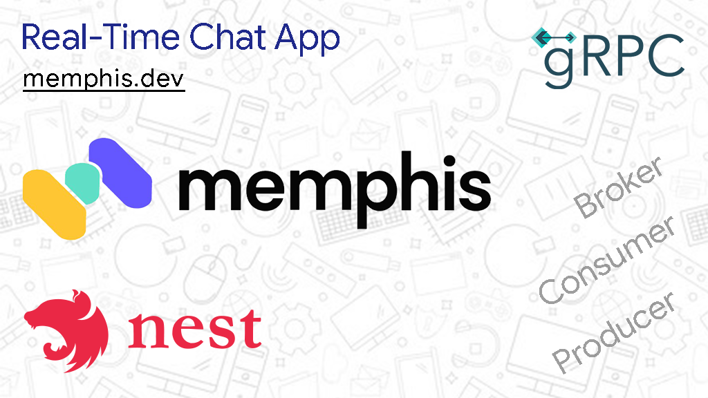

# FastChat 

A simple real-time chat application built with Memphis broker, NestJS, and gRPC. It uses a message queue (Memphis) to implement event-driven architecture. 

[Read the article on how to build it at  https://blog.obumnwabude.com/memphis-broker-nestjs-real-time-app/](https://blog.obumnwabude.com/memphis-broker-nestjs-real-time-app/)
